<picture>
  <source media="(prefers-color-scheme: dark)" srcset="./assets/hero-dark.svg">
  
</picture>

<a href="https://www.linkedin.com/in/anshul-mohanty-aa0361313/"><picture><source media="(prefers-color-scheme: dark)" srcset="./assets/btn-linkedin-dark.svg"></picture></a>&nbsp;
<a href="https://x.com/Anshul_Som"><picture><source media="(prefers-color-scheme: dark)" srcset="./assets/btn-x-dark.svg"></picture></a>&nbsp;
<a href="https://github.com/AnshulMohanty?tab=repositories"><picture><source media="(prefers-color-scheme: dark)" srcset="./assets/btn-repos-dark.svg"></picture></a>

 

<picture>
  <source media="(prefers-color-scheme: dark)" srcset="./assets/contributions-dark.svg">
  
</picture>

Redrawn every morning by a GitHub Action in this repository.

 

<picture>
  <source media="(prefers-color-scheme: dark)" srcset="./assets/stack-dark.svg">
  
</picture>

 

**House rules.** The number I report is the number I measured, with the command printed beside it. A model may phrase the sentence; it may not touch the digits. Where the evidence is wanting, the system declines, and says precisely which check it failed.

 

<a href="https://github.com/AnshulMohanty/HH_Goa">
  <picture>
    <source media="(prefers-color-scheme: dark)" srcset="./assets/voice-rag-dark.svg">
    
  </picture>
</a>

- The retrieval core (embed, search, confidence gate, extractive answer) measures **3.4 ms P50** against a 200 ms budget, with the benchmark command printed next to the number.
- Speech to text takes about 99% of the wall clock, so it is reported on its own line instead of being folded into the headline.
- The default answer is a verbatim span with its passage id. An opt-in Gemini pass writes prose and is discarded if it isn't grounded.

Node (ESM), Express, MiniLM on transformers.js, hnswlib, Zod, Gemini and Sarvam speech to text. [Read the write-up](https://github.com/AnshulMohanty/HH_Goa#readme)

 

<a href="https://github.com/AnshulMohanty/Saakshi">
  <picture>
    <source media="(prefers-color-scheme: dark)" srcset="./assets/saakshi-dark.svg">
    
  </picture>
</a>

- A rule-based Trust Engine flags reused, stock, off-site and drawn-on photos, each with the reason it was flagged.
- Before and after change is measured from segmentation masks on the same frame, not estimated by a model.
- Report totals are database aggregates, so every number links back to the photos it counted. Public images are signed and face-blurred.

Built for Code Cubicle 6.0 (Cloudinary track) with Next.js, TypeScript, Cloudinary, Drizzle, PGlite with pgvector, Inngest and Leaflet. [Read the write-up](https://github.com/AnshulMohanty/Saakshi#readme)

 

<a href="https://github.com/AnshulMohanty/Code_Flow">
  <picture>
    <source media="(prefers-color-scheme: dark)" srcset="./assets/codeflow-dark.svg">
    
  </picture>
</a>

- Eight stages, from ingest to a Q&A index, stream to the browser over server-sent events. The first six are deterministic and need no API key.
- An answer can only name a chunk id. The file path and line range come from the chunk that was actually retrieved, so a made-up line number can't be expressed.
- Import and call graphs, centrality, cycles, blast radius and Louvain communities, all computed from tree-sitter parses.

A pnpm and TypeScript monorepo: React with Vite, Express, BullMQ, Postgres with pgvector, MongoDB, Redis, and an MCP server for coding agents. [Read the write-up](https://github.com/AnshulMohanty/Code_Flow#readme)

 

 

<picture>
  <source media="(prefers-color-scheme: dark)" srcset="./assets/index-dark.svg">
  
</picture>

<a href="https://github.com/AnshulMohanty/HH_Goa"><picture><source media="(prefers-color-scheme: dark)" srcset="./assets/index-01-dark.svg"></picture></a> 
<a href="https://github.com/AnshulMohanty/Saakshi"><picture><source media="(prefers-color-scheme: dark)" srcset="./assets/index-02-dark.svg"></picture></a> 
<a href="https://github.com/AnshulMohanty/Code_Flow"><picture><source media="(prefers-color-scheme: dark)" srcset="./assets/index-03-dark.svg"></picture></a> 
<a href="https://github.com/AnshulMohanty/GradeSense"><picture><source media="(prefers-color-scheme: dark)" srcset="./assets/index-04-dark.svg"></picture></a> 
<a href="https://github.com/AnshulMohanty/TypeAhead"><picture><source media="(prefers-color-scheme: dark)" srcset="./assets/index-05-dark.svg"></picture></a> 
<a href="https://github.com/AnshulMohanty/RISC-V-Instruction-Set-Explorer"><picture><source media="(prefers-color-scheme: dark)" srcset="./assets/index-06-dark.svg"></picture></a> 

 

<picture>
  <source media="(prefers-color-scheme: dark)" srcset="./assets/karate-dark.svg">
  
</picture>

<picture>
  <source media="(prefers-color-scheme: dark)" srcset="./assets/off-the-keyboard-dark.svg">
  
</picture>

<a href="https://github.com/AnshulMohanty?tab=repositories"><picture><source media="(prefers-color-scheme: dark)" srcset="./assets/btn-repos-dark.svg"></picture></a>

Figures drawn in the style of <a href="https://hairline.lucasmarkes.com">Hairline</a> by Lucas Marques (MIT). Type: Mona Sans and Monaspace by GitHub, under the SIL Open Font License.
